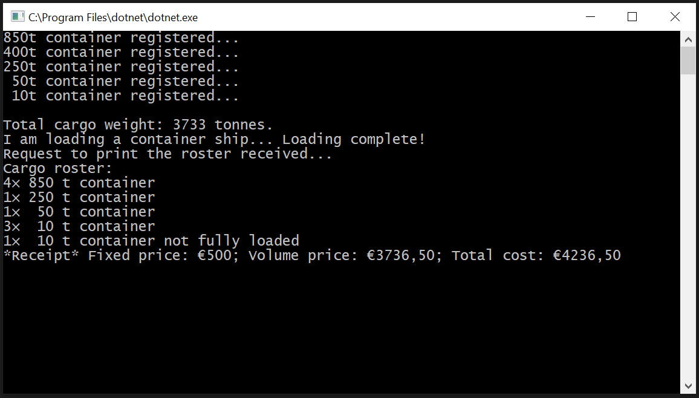

# Domácí úkol CargoShip
Vytvořte aplikaci, která umožní zákazníkům společnosti **TransAtlantic Cargo**, zabývající se převozem zboží ze zámoří do Evropy, efektivní plánování při pronájmu přepravních kontejnerů. 

Při přepravě zboží si zákazníci objednávají přepravní kontejnery s udanou kapacitou. Pro zvýšení efektivity lodní přepravy, musí být kontejner *zcela naplněn* zbožím. Kromě ceny za tunu se dále platí paušální poplatek za každý jednotlivý kontejner bez ohledu na jeho kapacitu.

Vytvořte proto aplikaci, která navrhne co nejmenší celkový počet kontejnerů nutných pro přepravu zadaného objemu/hmotnosti přepravovaného materiálu v jedné lodi. Dále vypočte předpokládanou cenu přepravy.

**Pro zjednodušení budeme pracovat pouze s hmotností. V reálné situaci se pracuje s objemovou kapacitou a maximální nosností kontejnerů!**

## Stanovení ceny za nakládku jedné lodě
Pevnou složku tvoří pronájem kontejneru. 
* Cena za kontejner je stanovena na *€ 50* bez ohledu na jeho objem/nosnost.

Pohyblivá složka se odvíjí od hmotnosti naloženého zboží a od nevyužité přepravní kapacity.
* Za každou tunu nákladu v kontejneru se platí *€ 1*. 
* Za každou "nevyužitou" tunu *50 % ceny za jednu tunu*.

### Příklad výpočtu
Pokud budeme mít k dispozici jediný *1000*tunový kontejner a naplníme ho zbožím o celkové hmotnosti *750 t*, potom zaplatíme `50 + 750 + 125 = € 925` 
Pokud budeme mít k dispozici jeden *500*tunový a jeden *250*tunový kontejner a naplníme ho zbožím o celkové hmotnosti *750 t*, potom zaplatíme `2 × 50 + 500 + 250 + 0 = € 850`

## Funkční požadavky:
* Maximální nosnost největšího kontejneru nesmí přesáhnout 1000 tun. 
* Nejmenší kontejner může být jednotunový.
* Do každé "lodě" lze registrovat nosnosti kontejnerů, se kterými lze při nakládce pracovat. (Viz screenshot.)
* Cena za kontejner (€50) je sice fixní, ale kód navrhněte tak, aby bylo možné pro jednotlivé lodě tuto cenu stanovit individuálně.
* Cenu za každou naloženou tunu lze také stanovit individuálně pro každou loď.
* Cena za nevyužitou tunu nákladu v kontejneru je nastavena pro každou loď individuálně – jako procento z ceny za nakládku "jedné tuny"
* Seznam naložených kontejnerů lze vytisknout nezávisle na informacích týkajících se cen
* Pokud některý z kontejnerů nebude použit, nechť se ve výpisu nezobrazuje!

## Nefunkční požadavky:
* K realizaci použijte vhodnou objektovou dekompozici
* Pokuste se využít rozhraní (`interface`)
* Pokuste se využít polymorfismu (`override, virtual, abstract`)
* Provádějte výpočty pouze jednou - bez závislosti na jejich vypisování
* Se třídou `System.Console` pracujte výhradně pouze v `Program.cs`!
